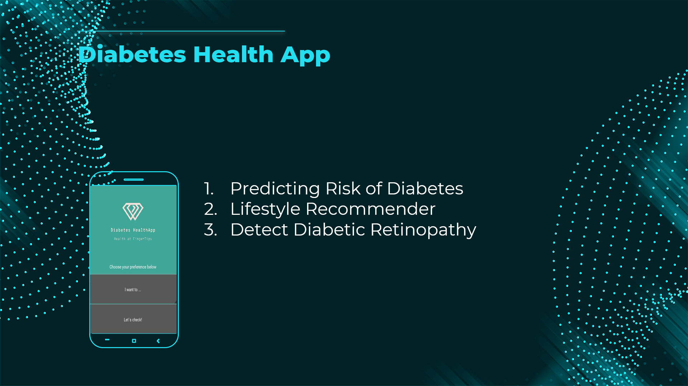

## SECTION 1 : IRS-PM-2022-02-12-IS04PT-GRP10-Diabetes-Health-App
## Diabetes Health App

---

## SECTION 2 : EXECUTIVE SUMMARY / PAPER ABSTRACT
Diabetes is a worldwide health problem that have affected 400 million people worldwide. There are two major types of diabetes:    
     
     Type 1 – often diagnosed in childhood.
     Type 2 – largely caused by an unhealthy lifestyle and diet.  

From a study by International Diabetes Federation (IDF) done in 2015, it revealed that Singapore had the second highest proportion of diabetes among developed nations. The number of diabetic cases were projected to further increase by another 200K to 600K by 2030. In terms of long-term complications, we had the highest rate of lower limb amputation in the world with about 1,200 diabetes patients undergoing amputation every year. 

While there is no cure for diabetes, Type 2 diabetes can be managed and prevented through one’s lifestyle. By leveraging on the power of machine learning and Artificial Intelligence (‘AI’), we aim to develop a tool to 

     1. Allow individual to self-assess their risk of having type 2 diabetes 
     2. Help individual manage diabetes 
     3. Look out for signs of complications such as blindness 
     4. Other health problem that often be linked with a diabetic patient (for future release). 

This is achieved using an AI-powered Do-It-Yourself (DIY) Diabetes Health App as a “minimum viable product” (MVP). The first release can be improved upon successive releases with more user experience.

---

## SECTION 3 : CREDITS / PROJECT CONTRIBUTION

| Official Full Name  | Student ID (MTech Applicable)  | Work Items (Who Did What) | Email (Optional) |
| :------------ |:---------------:| :-----| :-----|
| Sahendra Pang | A0135877N | Backend Application Development , Model Development and Testing (Strategy 3) , Video| e0938644@u.nus.edu |
| Santi- | A0249294R | Application Design and Development, Model Development and Testing (Strategy 1 & 2), Project Report Writing | e0938899@u.nus.edu |
| Sim Yuh Fan | A0249251E | Administrative Lead, UI/UX Development, Backend Application Development | e0938856@u.nus.edu |
| Tan Xiang Feng | A0072452L | Model Development and Testing (Strategy 3), Project Report Writing, Video | e0938623@u.nus.edu |
| Zhang Zhewei | A0249258R | Model Development and Testing (Strategy 1), Project Report Writing, Video| e0938863@u.nus.edu |

---

## SECTION 4 : VIDEO OF SYSTEM MODELLING & USE CASE DEMO

https://github.com/YFSIM/IRS-PM-2022-02-12-IS04PT-GRP10-Diabetes-Health-App/blob/main/Video/DiabeticHealthApp_Technical_Presentation.mp4

---

## SECTION 5 : USER GUIDE

`Refer to "User Manual.pdf" in project report folder at Github Folder: ProjectReport`

The document will contain below infromation

### [ 1 ] App User Manual

### [ 2 ] APK installation & build

### [ 3 ] Engine installation & build

---
## SECTION 6 : PROJECT REPORT / PAPER

`Refer to project report at Github Folder: ProjectReport`

---
## SECTION 7 : MISCELLANEOUS

`Refer to Github Folder: Miscellaneous`

### Data

### Data Preparation

---
